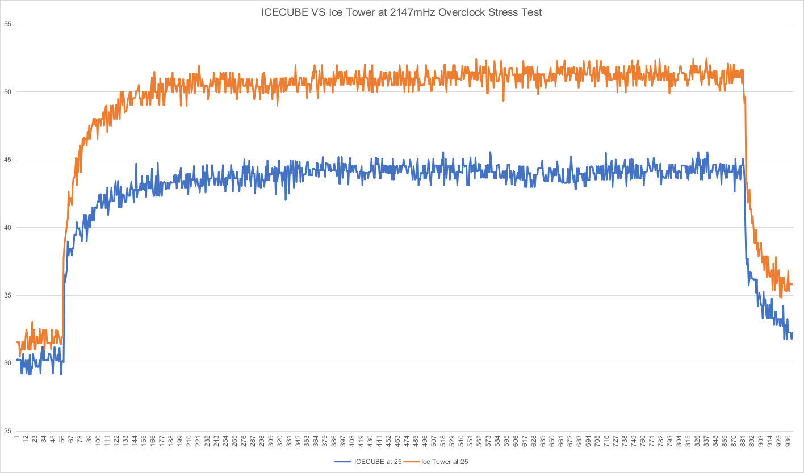
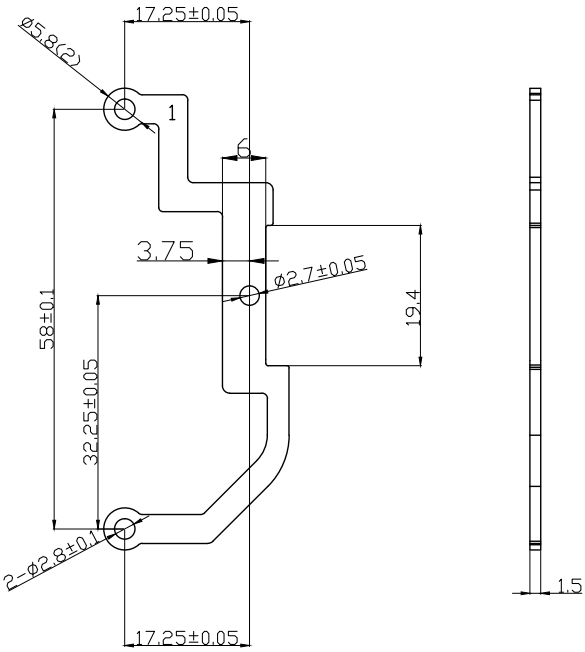
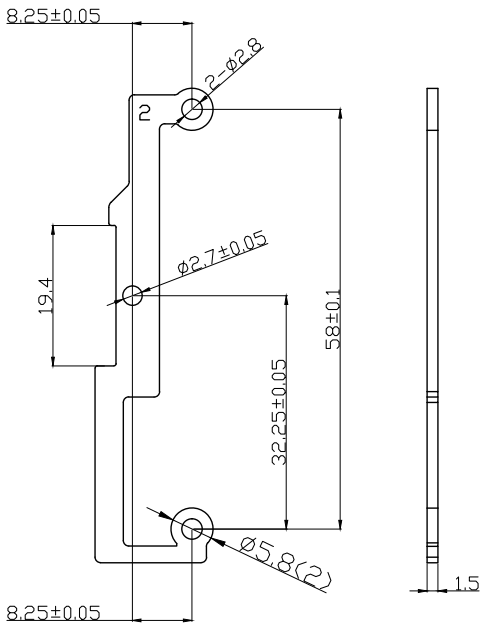
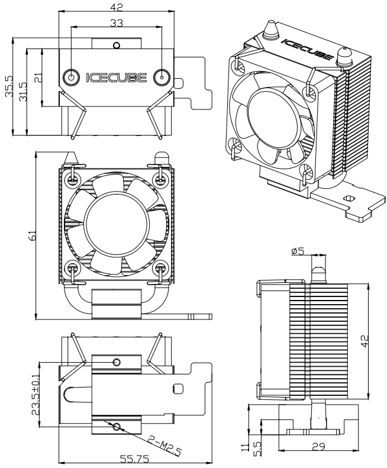

Specifications
===============

Mechanical and Electrical Parameters
----------------------------------------------

.. list-table:: Mechanical and Electrical Parameters
    :widths: 25 50

    * - Extermal dimension 
      - 40 * 40 * 10MM
    * - Weight
      - 13.5±5g/pcs
    * - Bearing
      - sleeve bearing
    * - life
      - 40,000 hours (Ambient temperature 25℃)

.. list-table:: Electrical Parameters
    :widths: 25 50

    * - Rated voltage
      - 5V
    * - Rated current
      - 0.08 A(Max: 0.10 A)
    * - Rated input power
      - 0.40 W(Max: 0.50 W)

.. list-table:: Efficiency
    :widths: 25 50

    * - Rated speed
      - 3500±10%RPM (tested in Ambient temperature 25℃ after 3 minutes of operation)
    * - Maximum air flow
      - 2.46CFM
    * - Maximum air pressure
      - 0.62mm-H2O
    * - Accoustic sound
      - 22.31dBA

.. list-table:: Characteristics
    :widths: 25 50

    * - Operating voltage range
      - 3V ~ 5.5V
    * - Starting voltage
      - 3V
    * - Operating temperature
      - -10℃ ~ +70℃
    * - Storage temperature
      - -30℃ ~ +85℃

Characteristic Curve
------------------------

Dimensional Drawing
----------------------------

**Fan**

.. image:: img/fan.png

**Metal Support**

**Tower Cooler**

Warning
------------

* Do not touch the blades, or let the power wires wrap around the fan, or pull the power wires with force to avoid damaging the fan.
* Do not use in environments with flammable gases or any danger.
* When the fan is working, please do not try to lock the fan for a long time. If you do so, the fan will burn out due to the high heat generated by the continuous stoppage.
* When assembling the fan, please pay special attention to the noise generated by resonance or vibration.
* Do not drop the Icecube Tower Cooler from height, as this may affect the balance of the fan's blades.

