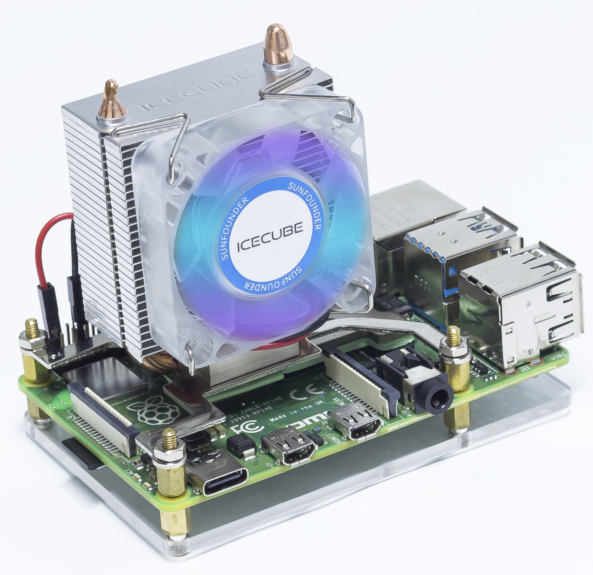

SunFounder Icecube Tower Cooler
===================================

* Product Size: 55.75*35.5*61mm
* Fan Size: 40*40*10mm
* HS Material: Aluminum
* Fan speed: 3500RPM
* Bearing Type: sleeve bearing
* Rated Voltage: 5V 
* RGB LED

This is a tower cooler designed for Raspberry Pi 3B+/4B, it has the following advantages.

* Compatible with Raspberry Pi 4 B and Raspberry Pi 3 B+, easy to assemble.
* Super Cooler - (Ambient temperature 25℃) Raspberry Pi 4 Model B 2gb version Idle Test: around 29℃; Full Load: less than 37℃; Overclock（2147 MHz）: less than 46℃
* Tower Structure - 28 Aluminium Fins and 5mm Copper Pipe provides effectively excellent heat dissipation.
* Silent RGB LED Fan - Speed: 3500RPM; Air Flow: 2.46CFM; Noise Level: 22.32dBA; Rated Power: 0.4W @5V, 0.08A.
* Cooling 4 Chips - Not just the CPU, the cooling base also covers the RAM, Ethernet and USB chips.

.. toctree::

    components_list_assembly
    features
    replace_fan

Copyright Notice
-----------------------
All contents including but not limited to texts, images, and code in this manual are owned by the SunFounder Company. You should only use it for personal study,investigation, enjoyment, or other non-commercial or nonprofit purposes, under therelated regulations and copyrights laws, without infringing the legal rights of the author and relevant right holders. For any individual or organization that uses these for commercial profit without permission, the Company reserves the right to take legal action.